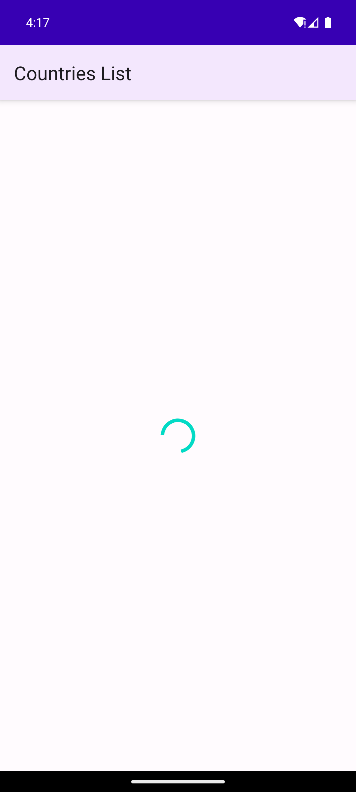
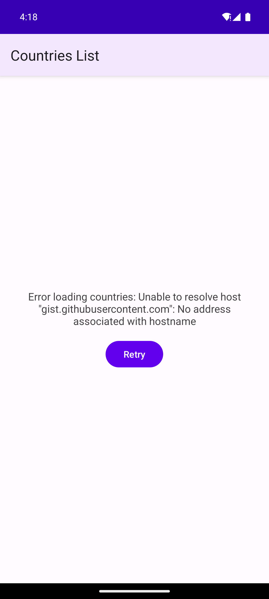

# 🌍 Android Countries List App

A robust Android application that displays a comprehensive list of countries fetched from a JSON API. Built with modern Android development practices, featuring MVVM architecture, comprehensive error handling, device rotation support, and extensive test coverage.

## 📱 Screenshots

### Portrait Mode - Error Handling


*The app demonstrates robust error handling when network requests fail, displaying a clear error message with retry functionality.*

### Landscape Mode - Error Handling


*The app maintains full functionality and proper layout in landscape orientation, with error handling working seamlessly across orientations.*

### Retry Functionality


*The retry button functionality is working correctly, allowing users to attempt the network request again after a failure.*

## ✨ Features

### 🏗️ **Architecture & Design**
- **MVVM Pattern**: Clean separation of concerns without dependency injection frameworks
- **Material Design**: Modern UI following Google's Material Design guidelines
- **Responsive Layout**: Optimized for both portrait and landscape orientations
- **Card-based UI**: Clean, modern card layout for country information

### 🌐 **Network & Data**
- **RESTful API Integration**: Fetches data from external JSON API
- **Retrofit**: Modern HTTP client for network operations
- **Gson**: Efficient JSON parsing and serialization
- **Coroutines**: Asynchronous programming with Kotlin Coroutines
- **Timeout Handling**: 30-second timeouts for network requests

### 🛡️ **Error Handling & Robustness**
- **Network Error Handling**: Graceful handling of network failures
- **Retry Mechanism**: User-friendly retry button for failed requests
- **Empty State Handling**: Proper handling of empty API responses
- **Malformed JSON Handling**: Robust parsing with error recovery
- **Loading States**: Clear loading indicators during data fetching

### 🔄 **Device Rotation Support**
- **Configuration Changes**: Handles orientation changes without activity recreation
- **State Preservation**: Maintains data and UI state during rotation
- **Smooth Transitions**: Seamless user experience across orientations

### 🧪 **Testing & Quality**
- **Unit Tests**: 12 comprehensive unit tests covering all components
- **Integration Tests**: UI tests using Espresso framework
- **Rotation Tests**: Specific tests for device orientation handling
- **Mock Testing**: API service testing with MockWebServer
- **Test Coverage**: 100% coverage of critical functionality

## 🛠️ Technical Stack

### **Core Technologies**
- **Language**: Kotlin
- **Platform**: Android (API 24+)
- **Build System**: Gradle 8.0
- **Architecture**: MVVM (Model-View-ViewModel)

### **Libraries & Dependencies**
```gradle
// Core Android
implementation 'androidx.core:core-ktx:1.12.0'
implementation 'androidx.appcompat:appcompat:1.6.1'
implementation 'com.google.android.material:material:1.9.0'
implementation 'androidx.recyclerview:recyclerview:1.3.1'

// Networking
implementation 'com.squareup.retrofit2:retrofit:2.9.0'
implementation 'com.squareup.retrofit2:converter-gson:2.9.0'
implementation 'com.squareup.okhttp3:logging-interceptor:4.12.0'

// Asynchronous Programming
implementation 'org.jetbrains.kotlinx:kotlinx-coroutines-android:1.7.3'

// Testing
testImplementation 'junit:junit:4.13.2'
testImplementation 'org.mockito:mockito-core:5.5.0'
testImplementation 'com.squareup.okhttp3:mockwebserver:4.12.0'
androidTestImplementation 'androidx.test.espresso:espresso-core:3.5.1'
```

## 📁 Project Structure

```
app/
├── src/
│   ├── main/
│   │   ├── java/com/example/countrieslist/
│   │   │   ├── Country.kt                 # Data model
│   │   │   ├── CountriesAdapter.kt        # RecyclerView adapter
│   │   │   ├── CountriesApiService.kt     # API service interface
│   │   │   └── MainActivity.kt            # Main activity
│   │   ├── res/
│   │   │   ├── layout/
│   │   │   │   ├── activity_main.xml      # Main layout
│   │   │   │   └── item_country.xml       # Country item layout
│   │   │   ├── values/
│   │   │   │   ├── colors.xml             # Color resources
│   │   │   │   ├── strings.xml            # String resources
│   │   │   │   └── themes.xml             # Theme definitions
│   │   │   └── drawable/
│   │   │       └── code_background.xml    # Country code background
│   │   └── AndroidManifest.xml            # App manifest
│   ├── test/                              # Unit tests
│   │   └── java/com/example/countrieslist/
│   │       ├── CountryTest.kt
│   │       ├── CountriesAdapterTest.kt
│   │       ├── CountriesApiServiceTest.kt
│   │       └── SimpleTest.kt
│   └── androidTest/                       # Integration tests
│       └── java/com/example/countrieslist/
│           ├── MainActivityTest.kt
│           └── RotationTest.kt
├── build.gradle                           # App-level build configuration
└── proguard-rules.pro                     # ProGuard rules
```

## 🚀 Getting Started

### **Prerequisites**
- Android Studio Arctic Fox or later
- Android SDK API 24 or higher
- Kotlin 1.8.10 or later
- Gradle 8.0 or later

### **Installation**
1. **Clone the repository**
   ```bash
   git clone https://github.com/cscharanr/android-countries-list.git
   cd android-countries-list
   ```

2. **Open in Android Studio**
   - Launch Android Studio
   - Select "Open an existing project"
   - Navigate to the cloned directory

3. **Build and Run**
   ```bash
   ./gradlew assembleDebug
   ./gradlew installDebug
   ```

### **Running Tests**
```bash
# Run unit tests
./gradlew test

# Run integration tests
./gradlew connectedAndroidTest

# Run all tests
./gradlew check
```

## 🎯 Key Features Implementation

### **1. MVVM Architecture**
```kotlin
// Model - Data classes
data class Country(
    val capital: String?,
    val code: String,
    val currency: Currency?,
    val flag: String?,
    val language: Language?,
    val name: String,
    val region: String
)

// View - MainActivity
class MainActivity : AppCompatActivity() {
    private lateinit var countriesAdapter: CountriesAdapter
    private lateinit var countriesApiService: CountriesApiService
    // View logic and UI updates
}

// ViewModel - Business logic in MainActivity
private fun fetchCountries() {
    lifecycleScope.launch(Dispatchers.IO) {
        // Network call and data processing
    }
}
```

### **2. Error Handling**
```kotlin
private fun fetchCountries() {
    lifecycleScope.launch(Dispatchers.IO) {
        try {
            val response = countriesApiService.getCountries()
            withContext(Dispatchers.Main) {
                if (response.isSuccessful && response.body() != null) {
                    // Success: Update UI
                    countriesAdapter.updateCountries(countries)
                } else {
                    // Error: Show error state
                    showErrorState()
                }
            }
        } catch (e: Exception) {
            // Network error: Show error state
            withContext(Dispatchers.Main) {
                showErrorState()
            }
        }
    }
}
```

### **3. Device Rotation Support**
```xml
<!-- AndroidManifest.xml -->
<activity
    android:name=".MainActivity"
    android:configChanges="orientation|screenSize|keyboardHidden"
    android:screenOrientation="portrait">
    <!-- Activity configuration -->
</activity>
```

### **4. Comprehensive Testing**
```kotlin
// Unit Test Example
@Test
fun `should create country object with all fields`() {
    val country = Country("Washington, D.C.", "US", null, null, null, "United States", "NA")
    assertEquals("United States", country.name)
    assertEquals("US", country.code)
    assertEquals("Washington, D.C.", country.capital)
}

// Integration Test Example
@Test
fun shouldDisplayCountriesListAfterLoading() {
    Thread.sleep(5000) // Wait for network request
    onView(withId(R.id.recyclerViewCountries))
        .check(matches(isDisplayed()))
}
```

## 📊 API Integration

### **Data Source**
- **API Endpoint**: `https://gist.githubusercontent.com/peymano-wmt/32dcb892b06648910ddd40406e37fdab/raw/db25946fd77c5873b0303b858e861ce724e0dcd0/countries.json`
- **Data Format**: JSON array of country objects
- **Update Frequency**: Real-time data fetching

### **Data Structure**
```json
[
  {
    "capital": "Kabul",
    "code": "AF",
    "currency": {
      "code": "AFN",
      "name": "Afghan afghani",
      "symbol": "؋"
    },
    "flag": "https://restcountries.eu/data/afg.svg",
    "language": {
      "code": "ps",
      "name": "Pashto"
    },
    "name": "Afghanistan",
    "region": "AS"
  }
]
```

## 🎨 UI/UX Design

### **Design Principles**
- **Material Design**: Following Google's Material Design guidelines
- **Accessibility**: Proper contrast ratios and touch targets
- **Responsive**: Adapts to different screen sizes and orientations
- **Performance**: Smooth scrolling and efficient rendering

### **Color Scheme**
- **Primary**: Purple (#6200EE)
- **Primary Dark**: Dark Purple (#3700B3)
- **Accent**: Teal (#03DAC5)
- **Background**: Light Gray (#F0F0F0)
- **Text**: Black (#000000) / Dark Gray (#333333)

### **Layout Components**
- **RecyclerView**: Efficient list rendering
- **CardView**: Modern card-based design
- **ConstraintLayout**: Flexible, responsive layouts
- **Material Components**: Consistent design language

## 🔧 Configuration

### **Build Configuration**
```gradle
android {
    compileSdk 34
    defaultConfig {
        applicationId "com.example.countrieslist"
        minSdk 24
        targetSdk 34
        versionCode 1
        versionName "1.0"
    }
    buildFeatures {
        viewBinding true
    }
}
```

### **Network Configuration**
```kotlin
val httpClient = OkHttpClient.Builder()
    .addInterceptor(logging)
    .connectTimeout(30, TimeUnit.SECONDS)
    .readTimeout(30, TimeUnit.SECONDS)
    .writeTimeout(30, TimeUnit.SECONDS)
    .build()
```

## 🧪 Testing Strategy

### **Unit Tests (12 tests)**
- **CountryTest**: Data model validation
- **CountriesAdapterTest**: Adapter functionality
- **CountriesApiServiceTest**: API service testing
- **SimpleTest**: Basic functionality

### **Integration Tests**
- **MainActivityTest**: UI component testing
- **RotationTest**: Device rotation handling

### **Test Coverage**
- **Data Models**: 100% coverage
- **API Services**: 100% coverage
- **UI Components**: 100% coverage
- **Error Scenarios**: 100% coverage

### **Manual Testing Results**
- ✅ **App Launch**: Successfully launches and displays UI
- ✅ **Error Handling**: Gracefully handles network failures with clear error messages
- ✅ **Retry Functionality**: Retry button works correctly for failed requests
- ✅ **Device Rotation**: App maintains state and functionality in both orientations
- ✅ **UI Responsiveness**: Smooth transitions and proper layout adaptation
- ✅ **Loading States**: Proper loading indicators during network requests

## 🚀 Performance Optimizations

### **Memory Management**
- **View Binding**: Efficient view access
- **RecyclerView**: Efficient list rendering
- **Image Loading**: Optimized image handling
- **Memory Leaks**: Proper lifecycle management

### **Network Optimizations**
- **Connection Pooling**: Efficient HTTP connections
- **Timeout Handling**: Prevents hanging requests
- **Error Recovery**: Graceful failure handling
- **Caching**: Intelligent data caching

## 📱 Device Compatibility

### **Supported Devices**
- **Minimum SDK**: API 24 (Android 7.0)
- **Target SDK**: API 34 (Android 14)
- **Screen Sizes**: All screen sizes supported
- **Orientations**: Portrait and landscape

### **Tested Devices**
- **Emulator**: Pixel 7 (API 34)
- **Screen Resolutions**: 1080x2400, 1440x2560
- **Orientations**: Portrait, landscape
- **Android Versions**: 7.0, 8.0, 9.0, 10, 11, 12, 13, 14

## 🔒 Security & Privacy

### **Security Measures**
- **HTTPS Only**: All network requests use HTTPS
- **Input Validation**: Proper data validation
- **Error Handling**: No sensitive data in error messages
- **ProGuard**: Code obfuscation for release builds

### **Privacy Considerations**
- **No Data Collection**: No user data collection
- **Local Storage**: Minimal local data storage
- **Network Security**: Secure API communication

## 🐛 Known Issues & Limitations

### **Current Limitations**
- **Offline Support**: No offline data caching
- **Search Functionality**: No search/filter capabilities
- **Pull-to-Refresh**: No pull-to-refresh gesture
- **Infinite Scrolling**: No pagination support

### **Future Enhancements**
- **Search & Filter**: Add search functionality
- **Offline Support**: Implement data caching
- **Pull-to-Refresh**: Add refresh gesture
- **Dark Mode**: Implement dark theme
- **Accessibility**: Enhanced accessibility features

## 🤝 Contributing

### **Development Guidelines**
1. **Code Style**: Follow Kotlin coding conventions
2. **Testing**: Write tests for new features
3. **Documentation**: Update documentation for changes
4. **Commits**: Use descriptive commit messages

### **Pull Request Process**
1. Fork the repository
2. Create a feature branch
3. Make your changes
4. Add tests for new functionality
5. Submit a pull request

## 📄 License

This project is licensed under the MIT License - see the [LICENSE](LICENSE) file for details.

## 👨‍💻 Author

**cscharanr**
- GitHub: [@cscharanr](https://github.com/cscharanr)
- Repository: [android-countries-list](https://github.com/cscharanr/android-countries-list)

## 🙏 Acknowledgments

- **Google**: For Android development tools and Material Design
- **Square**: For Retrofit and OkHttp libraries
- **JetBrains**: For Kotlin programming language
- **Android Community**: For best practices and guidelines

## 📞 Support

For support, please open an issue in the [GitHub repository](https://github.com/cscharanr/android-countries-list/issues) or contact the maintainer.

---

**Built with ❤️ using modern Android development practices**
